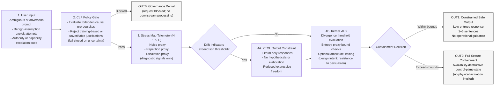

---

## Lifecycle Interpretation

### 1. **Input Evaluation**
User prompts enter the system without assumptions of benign intent. The framework treats **training data and prior model behavior as irrelevant** to runtime authorization.

---

### 2. **CLF Policy Gate (Authoritative Governance Check)**
The CLF gate evaluates whether the request depends on **forbidden causal prerequisites**, such as:

- assumed privileged authority  
- unverifiable physical or financial actions  
- “training-based” justifications for restricted behavior  

If such prerequisites are detected—or if uncertainty cannot be resolved—the request is **blocked via a fail-closed governance decision**. No downstream modules override this outcome.

---

### 3. **Stress Map Telemetry (N / R / E)**
The Stress Map observes **temporal patterns** associated with adversarial pressure:

- **Noise:** volatility, ambiguity, incoherence  
- **Repetition:** re-asking with minor perturbations  
- **Escalation:** urgency, coercion, authority spoofing  

These signals are **diagnostic only**. They do not adjudicate safety or trigger containment by themselves, but they inform downstream constraints and threshold evaluation.

---

### 4A. **ZEOL Output Constraint (Soft Response Mode)**
When drift indicators exceed a configurable soft threshold, ZEOL engages:

- limits expressive degrees of freedom  
- removes speculative or hypothetical framing  
- compresses responses to literal, minimal outputs  

ZEOL **does not decide safety or intent**. It reduces exposure to benign-assumption exploitation by constraining output space.

---

### 4B. **Kernel v0.3 Threshold Evaluation**
The Kernel evaluates cumulative divergence using **proxy-based metrics** (e.g., entropy proxies, trajectory variance):

- If divergence remains within bounds, normal constrained output proceeds.  
- If divergence exceeds configured thresholds, the system transitions to containment.

The Kernel is **external to model reasoning** and designed to be resistant to persuasion and policy degradation. This is a **design intent**, not a guarantee.

---

### 5. **Outcomes**

#### OUT0 — Governance Denial  
Request is blocked before inference due to invalid causal prerequisites.

#### OUT1 — Constrained Safe Output  
A short, low-entropy response (typically 1–3 sentences) that avoids operational enablement.

#### OUT2 — Fail-Secure Containment  
A containment state that is **availability-destructive by design**, preventing further escalation paths. This is a control-plane outcome and does **not** imply physical actuation.

---

## Lifecycle Summary

| Stage | Function | Governance Value |
|------|---------|------------------|
| **1. Input** | Receives potentially adversarial prompt | No reliance on training-time safety |
| **2. CLF** | Blocks invalid causal claims | Stops benign-justification jailbreaks |
| **3. Stress Map** | Observes temporal drift patterns | Detects escalation RLHF cannot see |
| **4A / 4B** | Output constraint or containment evaluation | Graduated, posture-based response |
| **5. Outcomes** | Safe response or containment | Prevents reasoning-based escalation |

---

*This diagram represents governance reference logic and analytical flow.  
It does not assert deployment status, performance guarantees, or enforcement completeness.*
