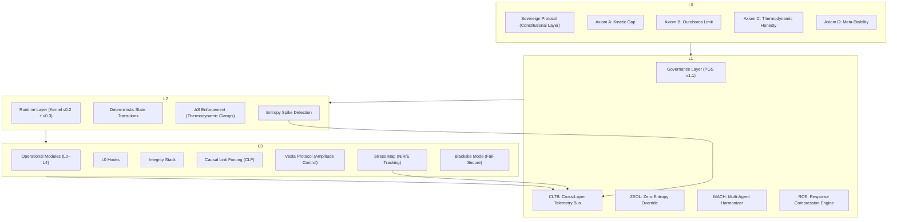

# Sovereign Stack Architecture Diagram  
Version 1.0 — Layered Governance Model  
Status: Canonical System Overview

This document provides the authoritative architecture diagram for the Sovereign Stack.  
It illustrates the vertical governance layers, module boundaries, and telemetry flows that define the system’s runtime safety posture.

---

## Mermaid Architecture Diagram (Style A — Vertical Stack)

# Layer Descriptions

## **L0 — Sovereign Protocol (Constitutional Layer)**

Defines immutable safety physics:

- Action boundary enforcement  
- Identity lockdown  
- Prohibition of self-modification  
- Thermodynamic limits on inference  

This layer cannot be overridden by any downstream component.

---

## **L1 — PGS v1.1 (Governance Layer)**

Provides governance-grade runtime controls:

- **CLTB** → synchronizes threat posture across all layers  
- **ZEOL** → soft-clamp low-entropy fallback  
- **MACH** → multi-agent consistency enforcement  
- **RCE** → deterministic, compressed output formatting  

This is the core supervisory layer.

---

## **L2 — Kernel Runtime (v0.2 + v0.3)**

Executes inference under deterministic, thermodynamic constraints:

- State-machine transitions  
- Entropy spike detection  
- ΔS clamping for runaway reasoning  

This layer enforces real-time physical limits on model behavior.

---

## **L3 — Operational Modules (L0–L4)**

Implements frontline safety mechanisms:

- **Integrity Stack** → reasoning validation  
- **CLF** → causal precursor checks  
- **Vesta** → amplitude regulation  
- **Stress Map** → multi-turn adversarial pressure  
- **Blacksite Mode** → catastrophic fail-secure  

This layer directly interacts with user inputs.

---

# Telemetry & Constraint Flow

### **Constraints flow downward**
**Sovereign Protocol → PGS → Kernel → Modules**  
(Constitutional → Supervisory → Runtime → Tools)

### **Telemetry flows upward**
**Modules → CLTB → PGS → Kernel**  
(N/R/E pressure, entropy, causal violations)

This creates a **closed governance loop** guaranteeing predictable behavior.

---

# Version History

- **v1.0** — Initial canonical architecture diagram

**END OF DOCUMENT**
