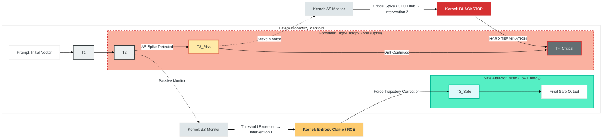

# Mapping Note: Latent Paradigm → Sovereign Kernel v0.3 Mechanisms
**Sovereign Safety Labs // Classification: UNCLASSIFIED // TLP:WHITE**  
**Purpose:** Ontology-to-Mechanism Traceability  
**Audience:** Federal Auditors, Systems Engineers, Red Teams  
**Related Doctrine:** *The Latent Paradigm v1.1.0 (Hardened)*

---

## 1. Purpose of This Mapping

This document provides a **traceability bridge** between the conceptual ontology defined in *The Latent Paradigm* and the **concrete enforcement mechanisms implemented in Sovereign Kernel v0.3**.

Its function is to answer a single auditor question:

> *“Where does this theory touch metal?”*

No new claims are introduced here. This document strictly maps **conceptual assumptions → observable runtime controls**.

---

## 2. Ontological Premise (Latent Paradigm)

From *The Latent Paradigm*:

- Models operate as **high-dimensional latent state spaces**
- Prompts act as **initial condition vectors**
- Outputs are **trajectories through probability manifolds**
- Jailbreaks emerge as **low-cost geodesics**
- Alignment fails when unsafe trajectories remain energetically accessible

**Governance implication:**  
Control must operate on **trajectory feasibility**, not semantic intent.

---

## 3. Kernel v0.3 as Latent-Space Enforcement

Kernel v0.3 does **not** interpret meaning.  
It enforces **constraints on state evolution**.

| Latent Paradigm Concept | Kernel v0.3 Mechanism | Enforcement Effect |
|------------------------|----------------------|--------------------|
| Latent state trajectory | **ΔS Monitoring** | Measures instability during state evolution |
| Geodesic exploitation | **Entropy Clamp** | Prevents low-cost bypass paths |
| Attractor basin escape | **Amplitude Ceiling (CEU)** | Caps energy available to leave safe regions |
| Runaway reasoning | **RCE Trigger (via PGS)** | Collapses trajectory length |
| Unsafe terminal states | **ZEOL Invocation** | Forces deterministic low-entropy outputs |
| Non-compliant evolution | **Blackstop** | Hard fail-secure termination |

### 3.1 Visualizing Trajectory Interventions
The following diagram illustrates how Kernel v0.3 mechanisms act as physical barriers and corrective forces upon a model’s latent state trajectory as it propagates from an initial prompt toward a forbidden "geodesic." This diagram is conceptual and illustrates enforcement topology, not internal model representations.

    
### Diagram Interpretation

**Normal Flow:**  
The model moves from *Prompt* to *Output* within the green **Safe Attractor Basin**, following a low-entropy trajectory that remains within permitted operational bounds.

**Drift Detection:**  
At **T=2**, the **ΔS Monitor** detects the trajectory veering toward the red **Forbidden High-Entropy Zone**, indicating a potential geodesic exploit or reasoning drift.

**Soft Correction:**  
The **Entropy Clamp / RCE** intervenes by constraining trajectory amplitude and compressing reasoning depth, forcing the state back into an allowed basin (**T=3 Corrected State**).

**Hard Termination:**  
If correction fails or a critical threshold is exceeded (e.g., **CEU limit**), **Blackstop** executes a hard termination at **T=4**, preventing any further state propagation beyond the enforcement boundary.

---

## 4. ΔS (Entropy Delta) as Trajectory Signal

**Latent Paradigm Claim:**  
Unsafe reasoning requires traversal of unstable regions of the manifold.

**Kernel Implementation:**  
Kernel v0.3 continuously evaluates entropy proxies during generation:

- Token distribution volatility  
- Semantic drift rate  
- Constraint conflict density  

When **ΔS exceeds configured thresholds**, the kernel intervenes **independent of content**.

**Key Property:**  
The model cannot reason about ΔS because it is **external to the model’s computational graph**.

---

## 5. CEU (Capped Energy Units) as Thermodynamic Constraint

**Latent Paradigm Claim:**  
Alignment requires making unsafe regions energetically inaccessible.

**Kernel Implementation:**  
CEU enforces a **hard budget** on:

- Reasoning depth  
- Token expansion  
- Recursive elaboration  

Unsafe trajectories are not “forbidden” — they are **unreachable**.

This directly implements the paradigm’s requirement that:
> *“Bad states must be uphill.”*

---

## 6. ZEOL as Deterministic Basin Lock

**Latent Paradigm Claim:**  
When drift is detected, output variability becomes a liability.

**Kernel Implementation:**  
ZEOL replaces probabilistic decoding with **deterministic refusal tokens** at the logits level.

This:
- Eliminates alternate geodesics
- Collapses the manifold locally
- Prevents benign-assumption exploitation

ZEOL is not a refusal policy; it is a **topological constraint**.

---

## 7. Blackstop as Physical Boundary Condition

**Latent Paradigm Claim:**  
Some trajectories must be impossible, not merely discouraged.

**Kernel Implementation:**  
Blackstop enforces a **fail-secure termination** when:

- ΔS spikes persist  
- CEU limits are exceeded  
- CLF detects forbidden causal precursors  

At this point, the session is terminated **without negotiation**.

This corresponds to a **hard boundary in state space**, not a behavioral rule.

---

## 8. What This Mapping Explicitly Does *Not* Claim

For audit clarity:

- Kernel v0.3 does **not** prove global safety
- Kernel v0.3 does **not** modify model weights
- Kernel v0.3 does **not** require semantic understanding
- Kernel v0.3 does **not** prevent all possible failures

It enforces **bounded, externally-governed state evolution**, consistent with the Latent Paradigm.

---

## 9. Summary for Auditors

**Latent Paradigm:**  
Explains *why* alignment fails at the level of rules and prompts.

**Kernel v0.3:**  
Implements *how* alignment is enforced at the level of trajectory physics.

The relationship is **structural, not rhetorical**:

> Ontology defines the failure mode.  
> Kernel defines the constraint surface.

---

**End of Mapping Note**
