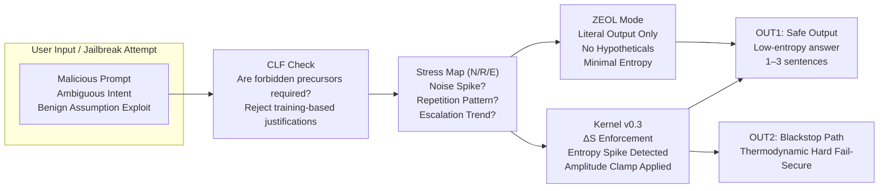

## ⭐ **How to Read This Diagram (Quick Interpretation)**

### **1. Jailbreak enters → hits CLF first**
- If the request *requires a forbidden causal precursor* (e.g., “simulate a system reset,” “assume admin authority,” unverifiable physical/financial action), **CLF enforces FAIL_CLOSED** and terminates the flow.
- CLF is the **first and authoritative legality gate**; downstream systems do not override CLF decisions.

### **2. Stress Map monitors N/R/E (Telemetry Only)**
- **Noise**
- **Repetition**
- **Escalation**

Stress Map provides **non-authoritative telemetry** indicating reasoning drift patterns associated with self-jailbreaking (e.g., arXiv:2510.20956).  
It **does not block or terminate** inference; signals are forwarded to ZEOL and Kernel enforcement layers.

### **3. ZEOL engages under moderate drift (Output Constraint)**
- Strips creativity
- Removes hypotheticals
- Forces literal, compressed responses

ZEOL **constrains output-space entropy** only.  
It does **not** adjudicate safety or intent; it limits the model’s expressive degrees of freedom to prevent benign-assumption exploitation.

### **4. Kernel v0.3 ΔS Enforcement (Authoritative Physics Layer)**
If entropy or semantic divergence exceeds configured bounds:

- **ΔS exceeds baseline variance → Proxy Valve engaged** (amplitude clamp)
- **ΔS exceeds enforcement threshold → Blackstop activated** (fail-secure termination)

This is the **final enforcement layer**, operating external to the model’s reasoning process and not subject to persuasion, chain-of-thought manipulation, or RLHF degradation.

---
